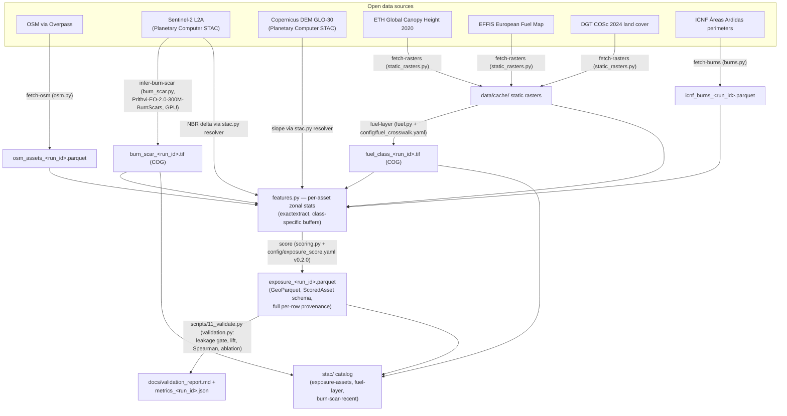

# wildfire-exposure-eo


> **Interactive geobrowser:**
> **[lunasilvestre.github.io/wildfire-exposure-eo](https://lunasilvestre.github.io/wildfire-exposure-eo/)**
> — the full pilot AOI at full fidelity, pure static (MapLibre, client-side
> COG rendering): exposure-ranked assets, fuel classes, burn-scar inference,
> ICNF perimeters, the validation headline, and download links for every
> published artefact. Source: [`docs/index.html`](docs/index.html); data
> generated by `scripts/15_make_geobrowser_data.py`.
> A committed offline sample also exists — the **smoke-AOI** folium map
> [`docs/figures/exposure_map_smoke.html`](docs/figures/exposure_map_smoke.html)
> (1 km × 1 km tile, 14 assets), regenerated by `scripts/12_make_figures.py`.

*Attribution: OSM contributors · ESA/Copernicus · ICNF · EFFIS/CEMS · DGT · ETH GCH (Lang et al. 2023)*

Which schools, substations, water plants and fire stations in a Portuguese fire district are most exposed to wildfire this season? This STAC-native pipeline answers that with a transparent, per-asset exposure **rank** built entirely from open data — OSM infrastructure, Sentinel-2, EFFIS/DGT fuel layers, ETH canopy height, Copernicus DEM terrain, and ICNF burned-area history — with full provenance on every scored asset and validation against the burns that happened after the score's input window. Built for municípios, civil-protection planners, and open-data auditors first: every number is reproducible from this repo.

> **Status (2026-06-11). Demonstrator complete — scope.** A thin, honest end-to-end slice: OSM-derived critical infrastructure on a Portuguese pilot AOI (Sever do Vouga / Albergaria-a-Velha / Oliveira de Azeméis), scored for relative wildfire exposure from public EO data with full per-asset provenance, and validated against the ICNF burns that happened *after* the score's input window ([validation report](docs/validation_report.md)). The smoke-AOI demo path is CPU-only and documented step-by-step in [`docs/demo.md`](docs/demo.md). Scope boundaries: exposure is a screening **rank**, not a probability; scores are AOI-relative; this is a public-data demonstrator, not an operational service. See [`CLAUDE.md`](CLAUDE.md) for session conventions.

## Why this exists

Critical infrastructure — power lines, substations, transformers, water-treatment plants, telecom towers, hospitals, schools, emergency-services facilities — is unevenly exposed to wildfire risk. Static hazard maps published by national agencies tend to be land-cover-driven, slow to update, and asset-agnostic. This project produces a per-asset wildfire-exposure score, derived from current-year EO data and validated against historical burn outcomes, scoped initially to a single Portuguese fire district as a methodology demonstrator.

The methodology generalizes nationally and beyond. The pilot is intentionally small so that the demo path runs end-to-end on the smoke AOI in minutes on CPU (~2.5 min cache-warm). The fuel-class layer is a rule-based EFFIS + DGT-COSc crosswalk — no model training. The recent-burn feature uses a pre-baked Prithvi-EO Burn-Scar COG produced on the `atlas` GPU host; that inference is the one GPU-only stage, replaced by a committed artefact in the CPU demo. See [`docs/methodology.md`](docs/methodology.md).

## What this is not

- Not a fire-spread or fire-behaviour simulation. We score relative exposure, not absolute probability.
- Not a replacement for commercial utility vegetation management products. Those use sub-meter commercial imagery, proprietary canopy-instance segmentation, and customer-validated ground truth. This is a public-data demonstrator that mirrors the *operational shape* of those products under open-data constraints.
- Not deployed as a live service. The deliverable is a reproducible repo + STAC catalog + GeoParquet asset table.

## Architecture



Two more diagrams — the step-by-step reproduction flowchart (CPU demo path +
GPU burn-scar route) and the per-row provenance/lineage graph — are in
[`docs/diagrams.md`](docs/diagrams.md).

## Pilot AOI

**Sever do Vouga / Albergaria-a-Velha / Oliveira de Azeméis** (Aveiro, PT-01) — bbox `[-8.598, 40.605, -8.242, 40.875]`, ~30 × 30 km. Chosen for documented historical burn frequency, mixed eucalyptus / Pinus pinaster / shrubland cover typical of the Atlantic Centro-Norte regime, dense REN + distribution OSM coverage, and sparse population. See `docs/aoi_rationale.md` for the full justification and the three alternatives retained on disk. Frozen as a single GeoJSON in `data/aoi/pilot.geojson` so every artifact references the same geometry.

A 1 × 1 km smoke AOI under `data/aoi/smoke.geojson`, centred on Sever do Vouga town, is the development-loop target.

Generalizable to any AOI by editing `data/aoi/pilot.geojson` and re-running the pipeline.

## Validation headline (pilot AOI)

<!-- generated by: scripts/11_validate.py at 4877c5d30cd33274db17992c6b7a0727ff96c41a ; input exposure_20260611T170549Z.parquet scored at 988e59f2eab0fde3bf389ee0d3c6eb2312b81ae7 -->

The exposure rank was computed from inputs **≤ 2024-12-31** and validated
against the ICNF burn perimeters of **2025** (19 perimeters, 95 ha inside the
AOI) — strictly after the input window, enforced by a hard temporal-leakage
gate. Of **3,045** scored assets, **5** had buffers that burned (base rate
0.16%). Cumulative lift at the top-30% of the rank: **2.66×**; Spearman ρ
**0.0371** (p = 0.041). The mandatory ablation (burn-history features
removed) scores top-decile lift 2.00× vs 0.00× for the full configuration —
with only 5 burned assets, a single asset moving deciles changes lift by
2.00×, so this run **does not resolve which features carry the signal**, and
fire's spatial autocorrelation means lift flatters any screen that uses burn
history. Read [`docs/validation_report.md`](docs/validation_report.md) — the
ablation row first. The defensible claim, in full: *a transparent,
reproducible prioritization screen validated against subsequent burns* —
nothing stronger.


## Data sources

All sources are public, STAC-native where possible, COG-friendly, and citable.

> **Sample audit run.** A reference run of `uv run wildfire-exposure-eo audit` against the Sever do Vouga pilot AOI is committed at [`docs/samples/audit_pilot_aveiro.json`](docs/samples/audit_pilot_aveiro.json) — **9/9 GREEN** as of 2026-05-12, covering Sentinel-2 L2A, Sentinel-1 GRD, Cop-DEM GLO-30, ESA WorldCover, ETH GCH, HLS S30/L30, ICNF Áreas Ardidas, OSM Overpass, and IPMA. Anyone with the repo can re-run the audit on a fresh clone and compare.

### Earth observation

| Layer | Source | Resolution | Access | Role |
|---|---|---|---|---|
| Sentinel-2 L2A | Microsoft Planetary Computer STAC | 10 m | `pystac-client` + `stackstac` | Optical baseline, NDVI/NBR, fuel-class input |
| Sentinel-1 GRD | Microsoft Planetary Computer STAC | 10 m | `pystac-client` + `stackstac` | SAR backscatter, cloud-resilient vegetation structure |
| HLS S30/L30 | NASA LP DAAC STAC | 30 m | `pystac-client` | Harmonized multi-sensor for inter-annual analysis |
| Copernicus DEM GLO-30 | MS Planetary Computer STAC | 30 m | `pystac-client` | Slope, aspect, TPI |
| ETH Global Canopy Height (2020) | Lang et al. / MS PC | 10 m | direct download or STAC | Canopy-height feature |
| Meta Canopy Height (2024) | Meta open release | 1 m | direct tiles | Higher-resolution canopy comparison (optional) |
| ESA WorldCover 2021 | MS Planetary Computer STAC | 10 m | `pystac-client` | Land-cover prior |
| Dynamic World | Google EE / public mirror | 10 m | optional | Near-real-time land cover (optional) |

### Reference / validation

| Layer | Source | Format | Role |
|---|---|---|---|
| DGT COSc 2023/2024 | DGT (SMOS, Sentinel-2 ML pipeline) | 10 m raster, CC-BY 4.0 | **PRIMARY** — 4-class land-cover refinement input to the fuel-layer crosswalk |
| DGT COS 2018 / 2023 | DGT INSPIRE | GeoPackage, CC-BY 4.0 | **FUTURE** — species-level refinement (Pinus, Eucalyptus, Quercus splits); not in the shipped path |
| EFFIS European Fuel Map | JRC / Copernicus | GeoTIFF, free | **REFERENCE** — international NFFL-13 crosswalk anchor |
| Scott & Burgan FBFM40 | USFS / LANDFIRE | reference document | International fuel-model framework |
| ICNF Áreas Ardidas | ICNF (Instituto da Conservação da Natureza e Florestas) | annual polygons (Shapefile/GPKG) | Validation ground truth, history feature |
| ICNF Carta de Combustíveis Florestais | ICNF | raster | **FUTURE** — national alignment target; no public direct-download URL (2026-05-07) |
| EFFIS Burned Area | JRC / Copernicus | annual polygons | Cross-border validation, EU-wide future scope |
| VIIRS NRT Active Fire | NASA FIRMS | CSV / GeoJSON | Recent fires (optional, contextual) |
| IPMA Daily FWI | IPMA | grid | Fire-weather multiplier (optional) |

The full taxonomy chain — DGT COSc + COS (operational inputs) → 9 internal classes (crosswalk output) → ICNF CCF (future alignment) + NFFL-13 via EFFIS (international reference) + FBFM40 (fire-behaviour modelling) — is documented in [`data/crosswalks/icnf_to_scott_burgan.yaml`](data/crosswalks/icnf_to_scott_burgan.yaml).

### Critical infrastructure

OSM is the universe of asset candidates, queried via Overpass with a frozen taxonomy. The taxonomy is itself a citable artifact, defined in `data/taxonomy/critical_infrastructure.yaml`. Each class carries:

- the OSM tag set that defines membership,
- a buffer-radius default for feature extraction,
- a criticality weight for portfolio aggregation,
- a license attribution string.

Initial classes:

```
power.transmission_line       (power=line, voltage>=60000)
power.distribution_line       (power=line, voltage<60000 OR power=minor_line)
power.substation              (power=substation)
power.transformer             (power=transformer)
power.tower                   (power=tower)
emergency.fire_station        (amenity=fire_station)
emergency.hospital            (amenity=hospital)
emergency.police              (amenity=police)
education.school              (amenity=school)
telecom.tower                 (man_made=communications_tower OR tower:type=communication)
water.treatment_plant         (man_made=water_works OR water=wastewater)
water.reservoir               (landuse=reservoir OR natural=water + reservoir tag)
transport.railway             (railway=rail)
```

Class list is intentionally short for the pilot. Extending is a YAML edit.

## Modeling approach

Two stages: a rule-based fuel-class layer, and a per-asset feature/score step. A planned fuel-class *segmentation model* (a SegFormer baseline plus an optional Prithvi/TerraTorch fine-tuned variant) was **scoped out** — the demonstrator derives fuel class from an EFFIS + DGT-COSc crosswalk instead, which is transparent, network-light, and needs no training. The one learned model in the shipped pipeline is the Prithvi-EO Burn-Scar inference (Stage 1b), run on GPU and consumed as a pre-baked COG.

### Stage 1 — fuel-class layer (rule-based crosswalk)

**Task.** Derive a per-pixel fuel-class COG over the AOI from existing fuel/land-cover products — no model training. `fuel-layer` reclassifies the EFFIS European Fuel Map (NFFL-13 codes) and refines it with DGT COSc 2024 land-cover via a documented crosswalk — e.g. where EFFIS says forest (models 8–10) but COSc says herbaceous, trust COSc, since the stand has likely burned or been cleared since the EFFIS vintage. The crosswalk to Scott & Burgan FBFM40 is retained for international fire-behaviour readability. Species-level DGT COS refinement (broadleaf/conifer/Pinus/Eucalyptus splits) is future work, not in the shipped path. See [`src/wildfire_exposure_eo/fuel.py`](src/wildfire_exposure_eo/fuel.py) and [`config/fuel_crosswalk.yaml`](config/fuel_crosswalk.yaml).

### Stage 1b — burn-scar inference (recent burns)

**Task.** Detect burn scars in Sentinel-2 imagery over the past 12 months across the AOI, producing a per-pixel burn-probability raster. This fills the gap between the latest published [ICNF Áreas Ardidas](docs/data_sources.md) vintage (~1-year lag) and "right now"; it captures the current fire season the historical layer cannot.

**Model.** [Prithvi-EO 2.0](https://github.com/NASA-IMPACT/Prithvi-EO-2.0) with the burn-scar downstream task — the canonical reference application of the model family and the one with the most public validation. The fine-tuned burn-scar checkpoint is loaded via TerraTorch and run **inference-only** — weights frozen, no training in this repo. The exact Hugging Face model ID is verified at audit time and recorded in the provenance dict (see CLAUDE.md non-negotiable #1).

**Output.** A burn-probability COG over the AOI, threshold-binarised for the per-asset `recent_burn_share_12mo` feature in Stage 2.

**What this is not.** Not ignition prediction. We detect burn *scars* — visible post-event spectral signatures — not forecasts of where fires will start. See CLAUDE.md anti-patterns.

### Stage 2 — per-asset feature extraction + exposure score

For each OSM asset, buffer by a class-specific radius (e.g., 30 m for power lines, 100 m for substations, 50 m for fire stations), extract:

| Feature | Source | Aggregator |
|---|---|---|
| `fuel_class_dominant` | Stage-1 output | mode |
| `fuel_class_severity_weight` | crosswalk table | weighted mean of per-class severity scores |
| `canopy_height_max_m` | ETH GCH | max |
| `canopy_height_p90_m` | ETH GCH | 90th percentile |
| `slope_mean_deg` | DEM | mean |
| `slope_max_deg` | DEM | max |
| `aspect_southness` | DEM | sin/cos transform, mean |
| `historical_burn_count_25y` | ICNF Áreas Ardidas | count of polygons intersecting the buffer in last 25 years |
| `historical_burn_share` | ICNF Áreas Ardidas | fraction of buffer area burned in last 25 years |
| `recent_burn_share_12mo` | **Stage 1b — Prithvi-Burn-Scar → S2** | fraction of buffer area flagged as burned in past 12 months |
| `nbr_delta_recent` | Sentinel-2 spring vs late-summer | mean |
| ~~`fwi_p95_recent_season`~~ | IPMA | *dropped in score v0.2.0 (no verified public FWI source) — future work* |

The composite exposure score is a transparent linear combination of normalized features with documented weights. No black-box ensemble. The point is auditability: any utility analyst should be able to read the score formula in five lines of YAML.

Materialised in [`config/exposure_score.yaml`](config/exposure_score.yaml) (v0.2.0):

```yaml
# config/exposure_score.yaml — six weights, sum to 1.0 (CI asserts this)
version: "0.2.0"
weights:
  fuel_class_severity_weight: 0.3333   # crosswalk-derived per-class severity
  canopy_height_p90_m:        0.2222   # ETH GCH 10 m, p90 in buffer
  slope_max_deg:              0.1111   # Cop-DEM GLO-30, max slope in buffer
  historical_burn_share:      0.1667   # decadal pattern (ICNF, ~1-yr lag)
  recent_burn_share_12mo:     0.1111   # current season (Prithvi burn-scar)
  nbr_delta_recent:           0.0556   # Sentinel-2 spring-vs-summer NBR delta
normalization: percentile_rank_within_aoi
```

A seventh feature, `fwi_p95_recent_season` (fire-weather), was **dropped in v0.2.0**: there is no GREEN, public, programmatic FWI source verifiable in-session, so the six remaining weights are renormalised (each old weight ÷ 0.90) and still sum to 1.0. FWI returns as future work behind a verified IPMA/Copernicus fetcher.

Calibration is **reported, not promised** — and in practice the output is a relative *rank*, so validation compares it against subsequent burns (lift, Spearman, ablation) with **no probability claim and no calibration plot**.

## Validation

The killer feature. Operates entirely on public data with a hard temporal-leakage gate:

1. Score the assets with `score --window-end T₀` — the demonstrator uses **T₀ = 2024-12-31**, so the rank sees only inputs on or before that date.
2. Take ICNF burned-area perimeters whose vintage is **strictly after** T₀ (the 2025 vintage for this run). `validation.assert_no_temporal_leakage` raises unless every validation burn post-dates the window.
3. Label each asset binary: does its class buffer intersect a post-T₀ burn perimeter?
4. Compute, over all scored assets:
   - **Lift** — burn rate within the top decile (and each cumulative decile) of the exposure rank, versus the AOI base rate.
   - **Spearman rank correlation** — exposure rank vs. subsequent burning.
   - A **mandatory ablation** with the burn-history features removed, reported beside the full configuration.

There is **no Brier score and no calibration plot**: the output is a relative *rank*, not a probability (non-negotiable #6). Results land in [`docs/validation_report.md`](docs/validation_report.md), regenerated by `uv run python scripts/11_validate.py` (there is no `make validate` target). The report is honest in both directions — with few post-window burns it states plainly when a run *does not resolve* which features carry the signal, and it notes that fire's spatial autocorrelation makes burn-history lift partly mechanical. Read the ablation row first.

## Stack

### Pinned

```
Python 3.11
uv (lockfile)
torch >= 2.6, torchvision >= 0.21     # Prithvi burn-scar inference (Stage 1b, GPU)
torchgeo >= 0.9
terratorch >= 1.2                     # Prithvi-EO 2.0 loader for the burn-scar model
transformers >= 4.50, lightning, peft, safetensors
pystac-client >= 0.8, pystac >= 1.11
stackstac >= 0.5, odc-stac >= 0.3
rioxarray, rasterio, xarray, dask
geopandas >= 1.0, shapely 2.x, pyproj, fiona
duckdb, pyarrow (GeoParquet workflows)
exactextract (zonal stats), osmnx (OSM), earthaccess (HLS auth)
pydantic, jsonschema, stac-validator
typer, rich (CLI)
fastapi, asyncpg, sqlalchemy 2.x, alembic   # optional serve/PostGIS path, unused in the pilot
pytest, hypothesis, ruff, pyright, pre-commit (dev extra)
```

### Why these and not others

- **STAC + stackstac/odc-stac** is the modern best practice for satellite ingestion. Eliminates manual scene download, makes provenance auto-citable.
- **TorchGeo** for samplers/transforms is canonical. We're not reinventing tile-grid logic.
- **TerraTorch + torch** carry the Prithvi-EO Burn-Scar inference (Stage 1b, GPU). There is no fuel-class model training in the shipped pipeline — fuel class is the EFFIS + DGT-COSc crosswalk.
- **GeoParquet** for vector outputs (not Shapefile, not GeoPackage as primary). Modern, columnar, plays with DuckDB and the broader Lake stack.
- **COG everywhere** for rasters. Cloud-friendly, range-readable, STAC-compatible.
- **No PostGIS for the pilot.** Asset volumes are small (<100k features at AOI scale). DuckDB + GeoParquet is faster, simpler, and zero-infra. PostGIS is the documented production path if asset volumes grow.
- **No live API for the pilot.** Optional `serve` command using FastAPI + DuckDB if needed for a demo, but the primary deliverable is the reproducible repo + STAC catalog + GeoParquet table.

## Outputs

Every output is a public, machine-readable, schema-validated file. No custom binary formats.

Local runs write to the gitignored `outputs/` tree (`parquet/exposure_<run_id>.parquet`,
`cogs/fuel_class_<run_id>.tif`, `cogs/burn_scar_<run_id>.tif`,
`validation/metrics_<run_id>.json`). The pilot run the validation report
describes is **published** at full fidelity:

```
stac/                                          # committed STAC 1.1 catalog (validates --recursive)
├── catalog.json
├── exposure-assets/exposure-assets-<run_id>/  # scored-asset GeoParquet, committed as the item's asset
├── fuel-layer/fuel-layer-<run_id>/            # fuel-class COG, committed as the item's asset
└── burn-scar-recent/burn-scar-<run_id>/       # item; the 38 MB COG itself is a Cloudflare R2 asset
                                               #   (https://wildfire.cheias.pt/…; href in the item)
```

The [geobrowser](https://lunasilvestre.github.io/wildfire-exposure-eo/) renders
exactly these artefacts client-side and links every download.

### Provenance schema (every scored asset row)

```python
{
  "asset_id": "osm:way/12345678",
  "asset_class": "power.transmission_line",
  "geometry": "<WKB, EPSG:4326>",
  "buffer_radius_m": 30,
  "fuel_class_dominant": "shrub-tall",
  "fuel_class_severity_weight": 0.72,
  "canopy_height_p90_m": 11.4,
  "slope_max_deg": 24.1,
  "historical_burn_count_25y": 2,
  "exposure_score": 0.81,
  "score_components": {...},  # all normalized features
  "provenance": {
    "score_config_version": "0.2.0",
    "burn_scar_model_id": "ibm-nasa-geospatial/Prithvi-EO-2.0-300M-BurnScars",
    "sentinel_2_stac_ids": ["S2A_MSIL2A_..."],
    "sentinel_1_stac_ids": ["..."],
    "dem_stac_id": "cop-dem-glo-30/...",
    "canopy_stac_id": "eth-gch-2020/...",
    "icnf_burns_vintage": "2024-12",
    "osm_snapshot_iso": "2024-12-01T00:00:00Z",
    "code_commit_sha": "abcd1234",
    "run_id": "2026-05-05T14-22-03Z-x7p2",
    "config_sha": "..."
  }
}
```

This schema is the load-bearing artifact. If the schema validates, the result is publishable.

## Repository layout

```
wildfire-exposure-eo/
├── README.md                       # this file
├── CLAUDE.md                       # Claude Code session conventions, must-read first
├── PRE_DEV_CHECKLIST.md            # to be completed before development starts
├── pyproject.toml                  # uv-managed, pinned
├── uv.lock
├── inventory.yaml                  # source of truth for STAC catalog (cheias-pt-stac pattern)
├── data/
│   ├── aoi/pilot.geojson           # frozen pilot AOI
│   ├── taxonomy/critical_infrastructure.yaml
│   └── crosswalks/
│       └── icnf_to_scott_burgan.yaml
├── config/
│   ├── exposure_score.yaml         # composite weights (v0.2.0)
│   └── fuel_crosswalk.yaml         # EFFIS NFFL + COSc → fuel-class crosswalk
├── src/wildfire_exposure_eo/
│   ├── audit.py                    # data-availability probes (audit / audit-all)
│   ├── osm.py                      # Overpass query + GeoParquet writer
│   ├── stac.py                     # pystac-client wrappers, deterministic ordering
│   ├── static_rasters.py           # ETH-GCH / EFFIS / DGT COSc fetch + cache
│   ├── burn_scar.py                # Prithvi-EO Burn-Scar inference (GPU) → COG
│   ├── burns.py                    # ICNF Áreas Ardidas loader + burn-history features
│   ├── fuel.py                     # EFFIS + DGT COSc crosswalk → fuel-class COG (no training)
│   ├── features.py                 # per-asset feature extraction (exactextract)
│   ├── scoring.py                  # composite exposure rank
│   ├── validation.py               # temporal-leakage gate, lift, Spearman, ablation
│   ├── schemas/                    # Pydantic v2 models (ScoredAsset, FuelLayer, …)
│   └── cli.py                      # `wildfire-exposure-eo <command>`
├── scripts/
│   ├── 00_overpass_smoke.py        # source probes (overpass / earthdata / planetary-computer)
│   ├── 09_burn_scar_audit.py       # ICNF Spearman/lift crosscheck for the burn-scar COG
│   ├── 09_burn_scar_sanity.py      # domain-shift sanity vs ICNF perimeters
│   ├── 11_validate.py              # historical-burn validation report emitter
│   ├── 11_demo_timing.py           # times the CPU demo path → docs/demo.md
│   ├── 12_make_figures.py          # WU-8 figures + folium map → docs/figures/
│   ├── 15_make_geobrowser_data.py  # geobrowser data bundle → docs/app/data/
│   └── 15_publish_stac.py          # publish geodata as committed STAC assets
├── tests/
│   ├── unit/
│   ├── integration/
│   ├── fixtures/                   # committed API-response samples (Overpass, ICNF, STAC)
│   └── conftest.py
├── docs/
│   ├── data_sources.md             # detailed source evaluation, links
│   ├── methodology.md              # the long-form spec
│   ├── aoi_rationale.md            # pilot AOI justification
│   ├── demo.md                     # step-by-step CPU demo path + timings
│   ├── validation_report.md        # generated by scripts/11_validate.py
│   ├── burn_scar_audit.md          # WU-1 burn-scar ICNF crosscheck
│   ├── diagrams.md                 # Mermaid pipeline / reproduction / lineage diagrams
│   ├── index.html, app/            # GitHub Pages geobrowser (MapLibre, pure static)
│   ├── glossary.md, roadmap.md
│   └── figures/                    # WU-8 figures land here (ranked-assets map, lift curve)
├── prompts/                        # canonical Claude Code prompts per work-unit
│   ├── 01_data_audit.md … 06_fuel_layer.md
│   ├── 09_burn_scar_inference.md   # WU-1 (GPU)
│   ├── 10_asset_features_score.md  # WU-6
│   ├── 11_validation_closeout.md   # WU-7
│   ├── 12_maps_story.md            # WU-8
│   └── 15_geobrowser.md            # WU-9 (geobrowser + geodata publishing)
├── stac/                           # generated STAC catalog (committed)
└── .github/workflows/
    └── ci.yml                      # ruff, pyright, pytest, stac-validator, schema checks
```

## CLI surface

```bash
uv run wildfire-exposure-eo audit            # data-availability check for one source group, no compute
uv run wildfire-exposure-eo audit-all        # full data-availability sweep across sources
uv run wildfire-exposure-eo resolve-stac     # STAC item resolution → manifest (deterministic ordering)
uv run wildfire-exposure-eo infer-burn-scar  # Prithvi-EO Burn-Scar inference → burn-probability COG (GPU)
uv run wildfire-exposure-eo fetch-osm        # OSM Overpass query → GeoParquet
uv run wildfire-exposure-eo fetch-rasters    # static rasters (ETH-GCH, EFFIS, DGT COSc) → cache
uv run wildfire-exposure-eo fetch-burns      # ICNF Áreas Ardidas → GeoParquet
uv run wildfire-exposure-eo fuel-layer       # EFFIS + DGT COSc crosswalk → fuel-class COG
uv run wildfire-exposure-eo score            # per-asset feature extraction + composite exposure rank
uv run wildfire-exposure-eo validate-schema  # validate a GeoParquet against the ScoredAsset schema
```

There is no single-command `demo`. The CPU demo is the step-by-step sequence in [`docs/demo.md`](docs/demo.md) — `audit → fetch-osm → fetch-rasters → fetch-burns → fuel-layer → score → validate` on the smoke AOI, ~2.5 min cache-warm (well under the 30-minute budget). Historical-burn validation runs via `uv run python scripts/11_validate.py`.

## Definition of done

- Public repo, MIT license, green CI on `main`.
- The CPU demo path runs on the smoke AOI — `audit → fetch-osm → fetch-rasters → fetch-burns → fuel-layer → score → validate`, with the pre-baked WU-1 burn-scar COG — well under a 30-minute budget (~2.5 min cache-warm). Documented step-by-step in [`docs/demo.md`](docs/demo.md). The GPU burn-scar inference (`atlas`, see [`docs/methodology.md`](docs/methodology.md)) is the documented reproduction route for that artefact, not part of the CPU demo.
- A STAC 1.1 catalog under `stac/` validates with `stac-validator validate --recursive`.
- A GeoParquet asset table under `outputs/parquet/` validates against the documented `ScoredAsset` schema (`validate-schema`).
- [`docs/validation_report.md`](docs/validation_report.md) is committed with reproducible lift, Spearman, and the mandatory ablation against subsequent ICNF burns — no Brier or calibration plot (the output is a rank, not a probability).
- Scope boundaries are stated honestly up front (the status note, "What this is not", and the validation report's caveats): exposure is a rank not a probability, AOI-relative, a public-data demonstrator.
- No dangling references to killed phases (foundation-model / SegFormer fuel-class training) in README, docs, or prompts.
- `CLAUDE.md` enforced by CI and pre-commit (see [`CLAUDE.md`](CLAUDE.md)).

## Related work

[FireScope](https://arxiv.org/abs/2511.17171) (INSAIT, CVPR 2026) publishes
a public Europe-wide wildfire *risk* map ("risk" is their vocabulary —
everything in this repo stays *exposure rank*), released CC-BY-4.0. A
post-ship comparison of this repo's transparent screen against FireScope on
the pilot AOI is sketched in
[`prompts/13_firescope_comparison.md`](prompts/13_firescope_comparison.md);
no comparison results exist yet. Commercial utility vegetation-management
products mirror the operational shape of this pipeline with proprietary
imagery and ground truth; this repo is the open-data, open-method
counterpart.

## Acknowledgments

This repo is heavily AI-augmented. Most of the prose, the YAML, the documentation scaffolding, and a lot of the structural code came out of Claude Code sessions. The decisions — pilot AOI, taxonomy boundaries, score formula, *"drop the upper-bound pins"*, *"the README sounds like job-application bait, fix it"*, *"Prithvi burn-scar is not ignition prediction"* — came out of me pushing back on it.

Think of it as pair programming where one partner never sleeps and the other one has the taste. The [`CLAUDE.md`](CLAUDE.md) in this repo is longer than most production READMEs because that's where the actual contract lives: the AI does the verbose work, the human keeps judgment.

If *"AI slop"* is hovering in the back of your mind while reading this — fair. The CI gates (`ruff`, `pyright`, schema validation, weights-sum-to-1.0 assertion), the verify-then-act protocol, and the anti-pattern list in [`CLAUDE.md`](CLAUDE.md) are there for exactly that reason. They don't care who typed which character; they care whether the thing is right.

*(Yes, Claude wrote this acknowledgments section too. The recursion is intentional.)*

## License

MIT. See [`LICENSE`](LICENSE).

## Citation

If you reference this in a talk, paper, or write-up:

```
Silvestre, N. et Claude (Anthropic) (2026). wildfire-exposure-eo: a STAC-native pipeline for
scoring critical infrastructure by wildfire exposure.
https://github.com/lunasilvestre/wildfire-exposure-eo
```
