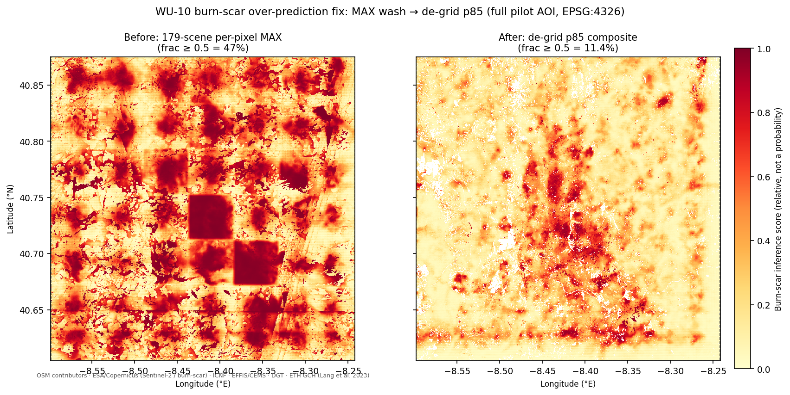
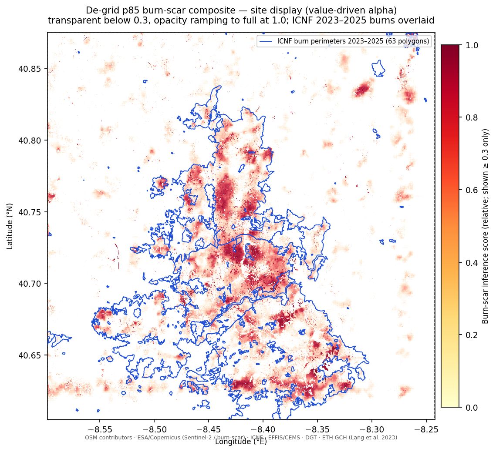

# Burn-scar layer — optimization log (WU-10)

A skimmable record of how the recent burn-scar inference layer went from an
over-predicting "wash" with a baked-in grid to a solid recent-scar detector.
Each effort is logged as **change → root cause → consequence (with numbers) →
status**. Every number here is reproducible from a script in this repo; the
`<!-- generated by: ... -->` markers cite it.

Terminology guard (CLAUDE.md non-negotiable #6): the raster value is a *burn-scar
inference score* — the model's relative class-1 score for a post-event burn
**scar**. It is **not** a calibrated probability, **not** a risk, and **not** a
fire forecast. Burn scars are spectral signatures of fires that **already
happened** — this is detection, never ignition prediction.

The candidate adopted by this work-unit is the **de-grid p85** composite,
run `20260615T192025Z`, COG `outputs/cogs/burn_scar_20260615T192025Z.tif`
(EPSG:4326), superseding the previous live run `20260610T072820Z`.

---

## 1. Over-prediction root cause — the 179-scene MAX composite

<!-- generated by: scripts/16_burn_scar_prefire_diag.py at 09b7ef2bb48feb74cbb49a12a926fe0ce76d6646 (outputs/diagnostics/burn_scar_prefire_diag_20260615T162457Z.json) -->

- **Symptom.** The original pilot raster looked uniformly "hot": AOI median
  score **0.47**, with **47 %** of valid pixels scoring ≥ 0.5 — a wash that
  swamped any real signal.
- **Root cause.** The composite reduced the 179-scene per-pixel stack with
  `np.fmax` (a MAX). MAX keeps each pixel's single highest score across all
  scenes, so any one-scene false positive is enshrined forever. A Phase-0
  diagnostic ran the model on a **single** pre-fire scene with no compositing
  and found it well-behaved on unburned land (only **3.6 %** of pixels ≥ 0.5,
  median 0.039) — proving the over-prediction was the reducer, not per-scene
  domain shift.
- **Consequence.** The reducer is the high-leverage fix.
- **Status:** diagnosed, root cause confirmed.

## 2. Reducer swap MAX → p85 (stack-and-reduce)

<!-- generated by: scripts/16_burn_scar_validate.py + scripts/16_burn_scar_multireducer_run.py at 229b0238bd45295d6d3fb199ac250397927f560f -->

- **Change.** Replace the streaming MAX with a stack-and-reduce that emits a
  per-pixel **85th-percentile** composite (`reduce_stack`, `reducer: p85`).
  p85 was chosen against `max`, `median`, and `consensus_3` on a single
  inference pass over the same 109-scene in-season stack.
- **Consequence.** Median score **0.47 → 0.11**; frac ≥ 0.5 **47 % → 11 %**;
  the saturated-square fraction (`frac_ge_095`) fell **8.59 % → 0.54 %** (~30×).
  p85 Pareto-dominates `max` at matched recall; `median`/`consensus_3` over-
  correct and collapse recall on genuine scars.
- **Residual.** A **faint regular grid** remained in the composite.
- **Status:** adopted as the reducer.

## 3. Tiling-artifact root cause — ViT per-crop centre bias, phase-locked × the composite

<!-- generated by: scripts/16_burn_scar_gridmetric.py at 508f835e44d94d1faf4f48b5dd82061d7167e9b7 (outputs/diagnostics/16_gridmetric_before_p85_nojitter.json) -->

- **Symptom.** A regular lattice of square cells, faint under p85, saturated
  under MAX.
- **Root cause (measured, not inferred).** The Prithvi/ViT model is **not
  translation-invariant**: each 512 px `tiled_inference` crop carries a
  tent-shaped class-1 response — high at the crop centre (~0.55), low at the
  border (~0.06), ~5× core/border. terratorch slides a **fixed** crop lattice
  (crop 512, stride 448, origin 0,0) over **every** scene, so the tent is
  **phase-locked** to the same UTM crop grid across all ~179 scenes. The
  per-pixel composite stacks every tent at the same pixels → saturated squares
  (MAX) or a faint grid (p85). The evidence is the autocorrelation **period**:
  an **anisotropic** peak at row ≈ 504 px / col ≈ 384 px — the *reprojected
  inference stride* (448 px in UTM 10 m, stretched by the warp to 4326), **not**
  the isotropic 512 px COG block. So the artifact is created at **inference**,
  not display.
- **Three competing hypotheses, each refuted by measurement** (meta-lesson:
  *measure, don't infer* — a code-only review had misdiagnosed this as H1):
  - **H1 — nodata zero-fill OOD.** Refuted: corr(crop masked-fraction, crop
    mean score) ≈ 0; masked crops do not saturate.
  - **H2 — blend seams between overlapping crops.** Refuted: the grid period
    matches the *stride*, not the seam spacing; the cosine feather works.
  - **H3 — per-tile normalisation.** Refuted: the norm means/stds are global
    constants read once from the model config, applied before tiling.
- **Status:** diagnosed, root cause confirmed.

## 4. De-grid fix — per-scene crop-origin jitter

<!-- generated by: scripts/16_burn_scar_gridmetric.py + scripts/16_burn_scar_validate.py at 508f835e44d94d1faf4f48b5dd82061d7167e9b7 (outputs/diagnostics/16_gridmetric_after_p85_degrid.json, 16_pr_curve_degrid_p85.json) -->

- **Change.** Break the phase-lock by jittering the crop-grid **origin** per
  scene. Before `tiled_inference`, the normalised scene is reflect-padded on the
  top/left by a deterministic per-scene `(dy, dx)` in `[0, stride)`, derived from
  seed 42 mixed with the STAC item id via blake2b (reproducible, order-
  independent — `burn_scar.scene_origin_offset`); the offset is inverted by
  cropping the returned probability back to the scene extent. The tent now lands
  at different pixels each scene, so the p85 composite averages it into the
  background. Exposed as `config/burn_scar.yaml: inference.tile_origin_jitter`
  (shipped `true`); recorded in `BurnScarRun` provenance. **No extra forward
  passes** — same crops, only the origin moves — so GPU cost is unchanged.
- **Consequence (full pilot, p85 before vs after de-grid).**

  | metric | before (no jitter) | after (de-grid) |
  |---|---|---|
  | autocorr peak (2D) | 0.467 @ lag (2, 505) px | 0.204 @ lag (0, 269) px |
  | grid_power_ratio | 0.069 | 0.015 (**−78 %**) |
  | saturated frac (`frac_ge_095`) | 0.0054 | 0.0012 (**−78 %**) |
  | stride peak, row 504 px | 0.46 | 0.12 |
  | stride peak, col 384 px | 0.46 | 0.18 |
  | recall@0.10 (ICNF-2025) | 0.49 | **0.86** |

  The stride-locked periodicity collapses while recall on the genuine scars is
  **preserved and improves**. A hygiene one-liner rode along: masked pixels are
  filled with the per-band reflectance **mean** (≈ 0 after normalisation,
  neutral) instead of `0.0` reflectance (≈ −mean/std, strongly OOD) — not the
  grid's cause, just a cleaner no-data treatment.
- **Status:** adopted; this is the published composite.

## 5. Validation truth-window correction — grade against persistent multi-year scars

<!-- generated by: scripts/16_burn_scar_multiyear_validate.py at eccf1a03fea4734ac621df975671ed581bb0544e (outputs/diagnostics/16_multiyear_detection_20260615T192025Z.json) -->

- **Problem.** The layer had been graded against **2025-only** ICNF perimeters,
  which cover just **0.1 %** of the pilot AOI (≈ 95 ha). At that prevalence a
  good detector looks broken (best-F1 **0.030**). But burn **scars persist for
  years** and are legitimately visible in the trailing-window imagery, so the
  correct detection truth is **recent multi-year** burns.
- **Change.** Re-validate the de-grid p85 COG, full-grid, against multi-year
  ICNF vintage windows. (No temporal-leakage gate is applied here — leakage
  binds the *forecasting* exposure score, not detection; see
  `docs/burn_scar_audit.md`.)

  | truth window | AOI coverage | best-F1 (thr) | precision @0.5 |
  |---|---|---|---|
  | 2025 only | 0.1 % | 0.030 (0.90) | 0.003 |
  | **2023–2025** | **24.8 %** | **0.644 (0.30)** | **0.806** |
  | 2021–2025 | 28.4 % | 0.619 (0.30) | 0.813 |

  The 2023–2025 window is dominated by the major **September-2024 Aveiro-region**
  fires. Against it the detector is **solid**: best-F1 **0.644** at thr 0.30
  (precision 0.60 / recall 0.70), precision **0.81** at 0.5 and **0.90** at 0.7.
  Over-prediction at thr 0.30 is ≈ **1.2×** (recall/precision = 0.70/0.60) — i.e.
  approximately calibrated in areal terms.
- **Consequence.** This is a good recent-scar detector; the "magnitude /
  land-cover gate" lever considered earlier is **not needed**.
- **Status:** validated; adopted as the evaluation framing.

## 6. Display fix — value-driven alpha

<!-- generated by: scripts/17_burn_scar_optimization_figures.py at eccf1a03fea4734ac621df975671ed581bb0544e (docs/figures/fig7_burn_scar_degrid_alpha_truth.png) -->

- **Change.** Paint the layer with **value-driven opacity**: fully transparent
  below **0.3**, opacity ramping linearly to full at 1.0 (`docs/app/app.js`,
  mirrored in `scripts/17_burn_scar_optimization_figures.py`). The analysis COG
  stays a continuous relative-score raster — only the rendering changes.
- **Consequence.** The low-score wash disappears and genuine scars stand out;
  pixels shown at full opacity (score ≥ 0.5) are predominantly inside the
  ICNF 2023–2025 burns.
- **Status:** shipped on the site.

### Figures

*Figure 6 — the 179-scene MAX composite (left, 47 % ≥ 0.5, saturated squares +
grid) vs the de-grid p85 composite (right, 11 % ≥ 0.5, grid gone). Shared
YlOrRd 0–1 scale, EPSG:4326. Regenerate:
`scripts/17_burn_scar_optimization_figures.py`.*

*Figure 7 — the de-grid p85 composite rendered with the site value-driven-alpha
rule (transparent below 0.3), with ICNF 2023–2025 burn perimeters overlaid. The
detector fires inside the recent burns.*

---

## Related session infrastructure optimizations

Not part of the burn-scar layer itself, but shipped alongside it this session:

- **Cloudflare hotlink CORS fix.** The R2-served geodata (`wildfire.cheias.pt`)
  needed a `no-referrer` policy so the GitHub-Pages site can fetch the COG and
  GeoJSON client-side without the browser sending a cross-origin referrer that
  Cloudflare's hotlink protection would reject.
- **Esri satellite basemap + opt-in hover labels.** The geobrowser gained an
  Esri World Imagery basemap for geographic context, with place labels surfaced
  on hover (opt-in) rather than always-on.
- **Usage gate.** The unattended close-out marathon gate was loosened — token
  floor **50 → 85**, per-slot budget **34M → 100M** — to let longer work-units
  (like this one) run to completion (`scripts/dev/`).
