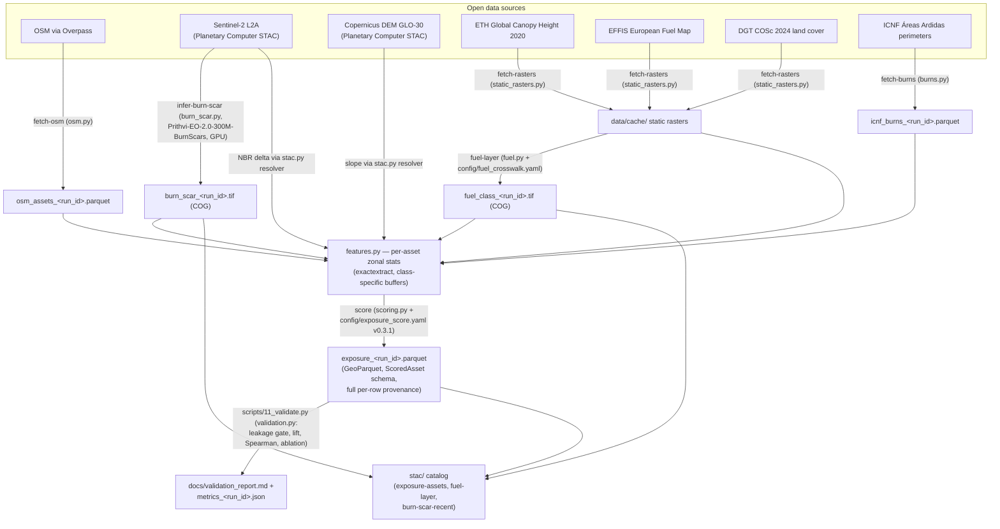
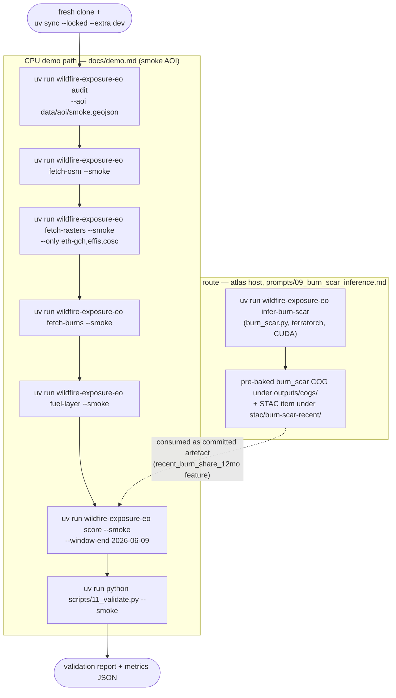
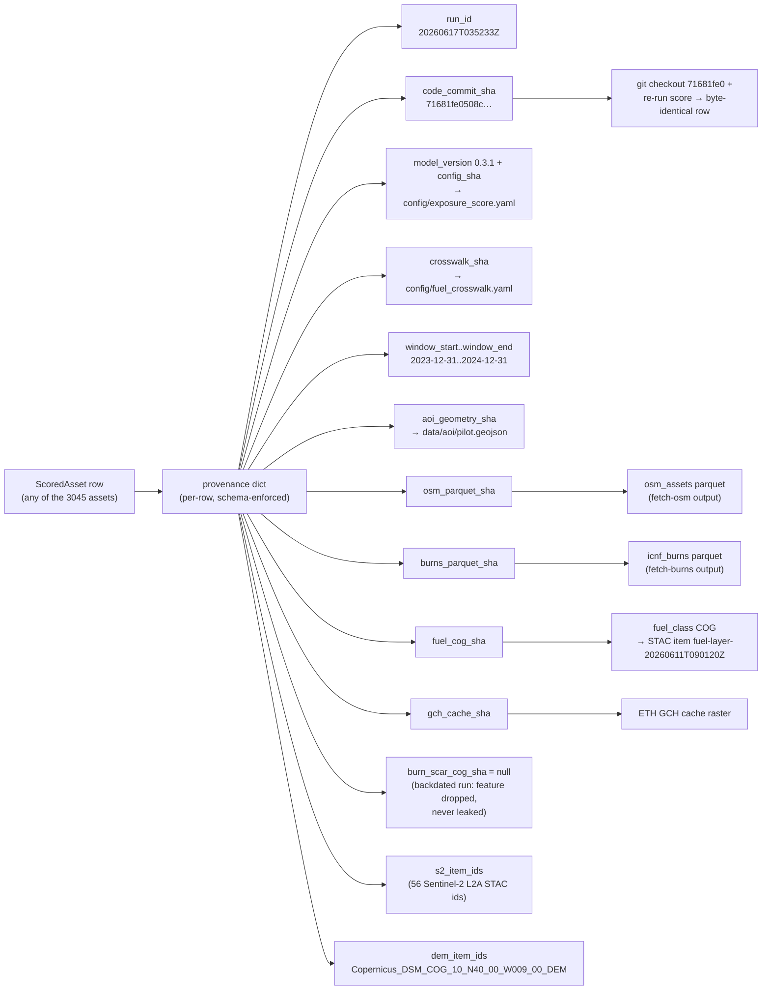

# Pipeline diagrams

Three Mermaid diagrams of the shipped pipeline. Every node names a real
module, CLI command, config file, or artefact in this repository — no
aspirational boxes. The geobrowser (`docs/index.html`) renders these same
blocks; GitHub renders them below.

The exposure score shown throughout is a **relative, AOI-normalised screening
rank** — not a probability of fire (CLAUDE.md non-negotiable #6).

## 1. Pipeline DAG (data flow)

<!-- The README architecture section embeds this same diagram. -->

## 2. Reproduction flowchart (CPU demo path + GPU route)

The CPU path mirrors [`docs/demo.md`](demo.md) step by step (~2.5 min
cache-warm on the 1 km² smoke AOI). The GPU route reproduces the pre-baked
burn-scar COG and is **not** required for the demo.

## 3. Provenance / lineage (one scored row → its exact inputs)

Field values shown are from the published run `20260617T035233Z` (the
backdated pilot run the committed validation report describes — STAC item
`exposure-assets-20260617T035233Z`).

