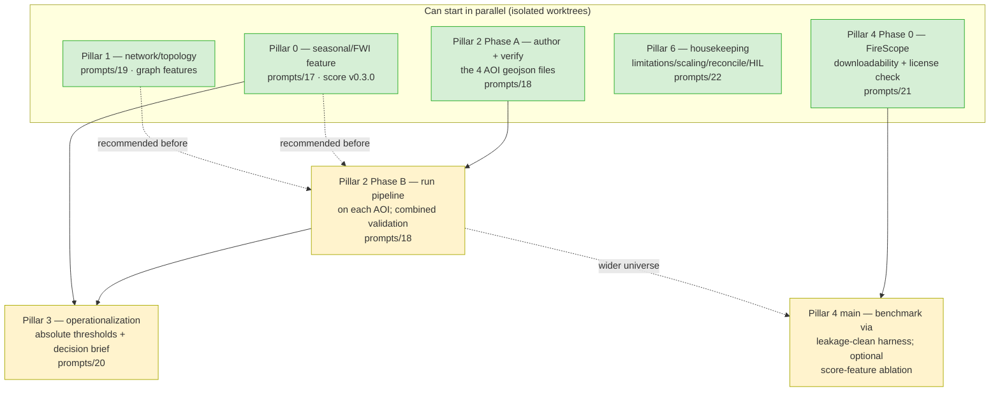

# Operationalization & sequenced program — `wildfire-exposure-eo`

> Working document, drafted 2026-06-16. **Companion to [`docs/strategy.md`](strategy.md)**
> (the positioning brief) and [`docs/roadmap.md`](roadmap.md) (what shipped).
> Strategy says *why* and *where we sit*; this document says *what we build next
> and in what order*. It supersedes strategy.md §7 ("Recommended next steps") as
> the executable program — strategy.md keeps the narrative, this keeps the DAG.
> Not a public-surface change; not a methodology edit. Audience: the executor
> (Claude Code) and the human reviewer.

---

## 1. The locked direction

This is a **credibility piece with an operational spine**. The rigor is the moat:
per-asset provenance, full reproducibility, STAC-native outputs, and honest
*rank-not-probability* validation. We improve the existing pipeline **in place** —
no new project, no rebuild on a prize foundation model. Every work-unit below
preserves the [`CLAUDE.md`](../CLAUDE.md) non-negotiables.

**The wedge, unchanged:** *"We don't map the fire. We rank the infrastructure the
fire would hit."* Five competing products (DGT, IPMA, ICNF, MEJOR/LUCI,
FireScope) resolve to a **cell, parcel, or polygon**. This repo resolves to an
**asset** — and, after the network pillar lands, to an **asset plus its
connectivity**. That column is the entire competitive argument.

---

## 2. Honest current limitations (the two a sharp reviewer finds first)

These are the weaknesses the program is built to fix. Stated plainly here so the
program reads as remediation, not feature-creep.

**L1 — the validation signal is statistically empty.**
<!-- generated by: scripts/11_validate.py at 4877c5d30cd33274db17992c6b7a0727ff96c41a -->
The pilot has **5 burned assets out of 3,045** (base rate 0.16%). At that count,
a single asset moving deciles swings top-decile lift by 2.00×, so the mandatory
ablation (burn-history features removed) ties or beats the full configuration and
the run **does not resolve which features carry the signal** (Spearman ρ ≈ 0.037).
Lift is uninterpretable until N(burned assets) reaches the dozens. This is the
core weakness; **pillar 2 fixes it.**

**L2 — the score is structural-only; the "this season" promise is unbacked.**
The shipped score (`config/exposure_score.yaml` v0.2.0) is six structural
weights. The two time-varying features are absent from the validated run:
`fwi_p95_recent_season` was **dropped project-wide** (no verified public
programmatic FWI source in-session), and `recent_burn_share_12mo` is **correctly
nulled** in the backdated validation to avoid leakage. So the ingredient that
makes LUCI/IPMA/DGT-RCM feel *current* — a live fire-weather/seasonal signal — is
the one we do not have. The README headline asks "...most exposed **this
season**?"; that word is currently unbacked. **Pillar 0 fixes it**, and pillar 3
(operationalization) depends on it.

A third, smaller boundary is documented and accepted, not a defect: scores are
**AOI-relative** (percentile-ranked within the AOI), so they are not comparable
across AOIs without a national reference distribution. Pillar 2 surfaces this
acutely (multiple AOIs) and pillar 3 must address it for absolute thresholds.

---

## 3. The six pillars

| # | Pillar | What it delivers | Fixes | Prompt |
|---|---|---|---|---|
| **0** | Seasonal / fire-weather signal | An open FWI / fire-danger feature (EFFIS-CEMS **or** xclim+ERA5) restored to the score | L2 (freshness) | `prompts/17` |
| **2** | Widen validation | 4 new bigger mainland-PT AOIs → push N(burned assets) into the dozens; calibrate | L1 (thin signal) | `prompts/18` |
| **1** | Network / topology exposure | Model power & water as **graphs**; an asset's exposure includes its connectivity | the differentiator | `prompts/19` |
| **3** | Operationalization | Planner-facing decision brief: top-N assets, **absolute** actionable thresholds | the payoff | `prompts/20` |
| **4** | FireScope benchmark | Consume INSAIT's open Europe 30 m risk raster through the leakage-clean harness; agreement both directions; optional score feature | credibility add-on | `prompts/21` |
| **6** | Housekeeping | `docs/limitations.md` + `docs/scaling.md`; reconcile roadmap↔strategy; close stale `_HIL.md` FLAG A | hygiene / debt | `prompts/22` |

> Pillar numbering follows the strategic labels, **not** execution order. The
> dependency graph in §4 and the schedule in §5 are the order that matters.

### Per-pillar definition-of-done (headline; full done-when in each prompt)

- **Pillar 0 (seasonal).** A new score feature backed by a **verified, public,
  programmatic** fire-weather source; `exposure_score.yaml` bumped to v0.3.0 with
  the feature weighted and weights summing to 1.0 (CI-asserted); provenance dict
  carries the source ID + vintage; unit + schema + smoke tests; no probability
  language. **Hard gate:** if no source verifies GREEN in-session (the v0.2.0
  failure mode), stop and surface — do not invent an identifier (#1).
- **Pillar 2 (widen validation).** 4 new `data/aoi/<name>.geojson` committed
  (pilot stays **frozen** per #10); the pipeline runs on each; a combined
  validation report aggregates N(burned assets) across AOIs into the dozens; lift
  and Spearman become interpretable; report says honestly whether the signal now
  resolves.
- **Pillar 1 (network/topology).** Power and water assets carry graph-derived
  exposure: a substation's score reflects its feeders + downstream served load; a
  water-treatment plant's reflects its reservoirs / served area. New
  topology-exposure feature(s) in the score, schema-versioned, with the graph
  construction documented and reproducible. **No invented connectivity** — edges
  derive from OSM topology + documented heuristics, flagged where inferred.
- **Pillar 3 (operationalization).** A `scripts/`-generated decision brief
  (top-N critical assets per AOI/município) with **absolute** thresholds (not
  just AOI-relative rank), output as a committed artifact (Markdown/PDF + the
  GeoParquet it derives from), every number reproducible. Honest framing: a
  prioritization screen, not a forecast (#6).
- **Pillar 4 (FireScope).** Gated on a downloadability/license check (Phase 0 of
  `prompts/13`). If GREEN: FireScope risk raster consumed through the **identical**
  WU-7 leakage-clean harness; agreement reported both directions; FireScope-zonal
  optionally added as a candidate score feature with an ablation row. CC-BY-4.0
  attribution; their vocabulary ("risk") quoted, ours stays "exposure rank" (#6).
- **Pillar 6 (housekeeping).** `docs/limitations.md` + `docs/scaling.md` written
  (both are README/Definition-of-done TODOs); `roadmap.md` reconciled with
  `strategy.md` (no contradictions, the network pillar is no longer "P2 later"
  in one doc and a shipped WU in another); `_HIL.md` FLAG A **closed** with the
  true current state (see §6).

---

## 4. Dependency graph

**Edge semantics.** Solid arrows are hard ordering (downstream needs the
upstream artifact). Dotted arrows are *recommended* ordering — the downstream WU
runs without the upstream, but is more valuable with it (e.g. widen-validation
*can* validate the structural score, but validating *with* the seasonal feature
and *with* topology features is the run worth reporting).

**The one rule that governs parallelism: who owns the score config.** Pillars 0,
1, and 4 all want to add a weight to `config/exposure_score.yaml`. Two WUs
editing that file concurrently is a merge conflict and a weights-sum-to-1.0 CI
break. Resolution: **serialize the `exposure_score.yaml` weight edits** even when
the feature *computation* code is built in parallel. Build the feature extractors
concurrently (different files: a new `fire_weather.py`, a new `topology.py`,
`firescope.py`); land the weight bumps one at a time, re-normalising and
re-asserting the sum each time. This is the single coordination point.

---

## 5. Recommended execution order (maximise safe parallelism)

The aim is heavy parallelism where dependencies allow — isolated git worktrees so
the repo's strict "one session owns the tree" rule is honoured per-worktree.

**Wave 1 — launch in parallel (4 worktrees, no shared files):**

1. **Pillar 0** (`prompts/17`) — seasonal feature *computation* in a new
   `fire_weather.py`. Highest leverage; everything downstream is better with it.
2. **Pillar 1** (`prompts/19`) — topology graph + features in a new `topology.py`.
   The headline differentiator; long-lead engineering, start it early.
3. **Pillar 4 Phase 0** (`prompts/21`) — FireScope downloadability + license
   check only. Cheap, gating; resolves whether pillar 4 main is even possible.
4. **Pillar 6** (`prompts/22`) — docs + reconciliation + close FLAG A. Touches
   only `docs/` and `prompts/_HIL.md`; zero code-path conflict; do it now so the
   repo is honest while the rest is in flight.

   *(Pillar 2 Phase A — authoring/verifying the 4 AOI geojson — can also run in
   Wave 1; it touches only `data/aoi/`. Bundle it with whichever worktree has
   slack, or run as a 5th.)*

**Serialization checkpoint (between waves):** land the `exposure_score.yaml`
weight bumps from pillars 0, 1, (and later 4) **one at a time**, each
re-normalising to sum 1.0. This is the only place Wave-1 outputs collide.

**Wave 2 — after the score carries the new features:**

5. **Pillar 2 Phase B** (`prompts/18`) — run the (now seasonal + topology) score
   on the 4 new AOIs; emit the combined validation report. Needs the AOIs
   (Phase A) and is most valuable after pillars 0 + 1 land.

**Wave 3 — the payoff:**

6. **Pillar 3** (`prompts/20`) — operationalization. Needs the validated, wider
   score (Wave 2) to set defensible **absolute** thresholds.
7. **Pillar 4 main** (`prompts/21`, if Phase 0 was GREEN) — benchmark on the
   widest universe (richer after Wave 2's AOIs).

**One-line order:** `{0, 1, 4-feasibility, 6, 2-AOIs}` in parallel → serialize
the weight bumps → `2-validation` → `{3, 4-benchmark}`.

---

## 5b. The 4-AOI proposal for pillar 2 (widen validation)

> **DRAFT — every bbox below must be finalised and verified against ICNF burned-
> area coverage before the geojson is frozen.** Coordinates here are approximate
> working values, not committed identifiers (non-negotiable #1). The pilot
> (`data/aoi/pilot.geojson`, Sever do Vouga) stays **frozen** (#10); these become
> **new** `data/aoi/<slug>.geojson` files used for validation only.

**Material finding (reuse, don't reinvent).** The repo already ships three
alternative AOI geojson files with documented rationale in
[`docs/aoi_rationale.md`](aoi_rationale.md), retained from the 2026-05-07 pilot
selection as "transfer-learning checkpoints": `alt_pedrogao_grande.geojson`,
`alt_serra_da_estrela.geojson`, `alt_peneda_geres.geojson`. Each has a matching
`smoke_<slug>.geojson`. **Three of the four proposed AOIs are these files
promoted to first-class validation AOIs** — their bboxes are already on disk and
their rationale is already written. Only the fourth (a WUI AOI) is genuinely new.
This makes pillar 2 Phase A largely a *promotion + verification* job, not an
authoring-from-scratch job, and keeps #1 satisfied (no fresh invented coords for
three of four).

Each AOI stresses the model on a different axis, and each is **bigger / different**
from the ~30×30 km Atlantic-Centro pilot:

| # | Slug | Anchor event (year) | Axis it stresses | Approx bbox (DRAFT — verify vs ICNF) | On disk? |
|---|---|---|---|---|---|
| 1 | `pedrogao_grande` | Pedrógão Grande / Pampilhosa 2017 mega-fire (~30k ha single fire / ~45k ha complex; deadliest in PT history) | **Large historical scar + scale** (~52×55 km, oversized on purpose → most burned pixels) | `[-8.3, 39.8, -7.7, 40.3]` | ✓ `alt_pedrogao_grande.geojson` |
| 2 | `serra_da_estrela` | Serra da Estrela / Manteigas 2022 (~25k ha; Copernicus EMSR618) | **High-mountain / protected-area regime**, distinct biome + clean EMS ground truth | `[-7.727, 40.215, -7.373, 40.485]` | ✓ `alt_serra_da_estrela.geojson` |
| 3 | `peneda_geres` | PNPG 2025 Lindoso/Ponte da Barca fire (~5.8k ha in-park / ~7.5k ha perimeter, ICNF **preliminary**) | **Norte-mountain distribution shift** (granite/shrub fuel, different fire-weather drivers) | `[-8.452, 41.715, -8.087, 41.985]` | ✓ `alt_peneda_geres.geojson` |
| 4 | `monchique` | Serra de Monchique 2018 (~27.2k ha; Copernicus EMSR303; threatened Monchique town) | **Wildland-urban interface** (documented threat to a populated centre; Algarve regime, unlike the others) | `[-8.72, 37.18, -8.38, 37.45]` *(new)* | ✗ author new |

**How each complements the pilot:**

- **Pedrógão (2017)** — the pilot is a *recent* burn (2024) with a thin perimeter
  set; Pedrógão is the *largest, oldest, densest* scar in continental Portugal.
  It contributes the most burned pixels per unit effort → the biggest single lever
  on N(burned assets). Oversized bbox is intentional.
- **Serra da Estrela (2022)** — the pilot is low-altitude Atlantic eucalyptus;
  Estrela is high-mountain shrub+pine with a **clean Copernicus EMS perimeter**
  (EMSR618) as independent ground truth, testing the score on a different fuel/
  terrain regime and a vetted label set.
- **Peneda-Gerês (2025)** — a deliberate **distribution-shift probe**: granite/
  shrub Norte-mountain regime, the one PT national park, very recent. Tests
  whether the score transfers off the Centro template. (Flag the **preliminary**
  ICNF figures; finalise before freezing.)
- **Monchique (2018)** — the **WUI** axis the pilot only partially has: an Algarve
  fire with a primary-source statement that it threatened the urban area of
  Monchique. Different climate zone entirely (Mediterranean Algarve vs Atlantic
  Centro). This is the one AOI to author fresh; its ~30×30 km bbox above is a
  working value to be tightened around the EMSR303 scar before freezing.

**A fifth candidate to hold in reserve (not in the four):** a 2024 **Viseu /
Dão-Lafões** box (e.g. Castro Daire / São Pedro do Sul / Oliveira de Frades,
~`[-8.20, 40.50, -7.85, 40.78]`) — the single most-burned region in the Sept-2024
episode (~20.8k ha), sitting just **east** of the pilot's eastern edge (-8.242)
with minimal overlap. It pairs naturally with the pilot as a same-episode,
adjacent-but-distinct validation set if a fifth AOI is wanted. Verify overlap and
ICNF coverage before use.

**Verification gate before freezing any of the four (pillar 2 Phase A):** for each
AOI confirm (a) the data audit is GREEN (S2/S1/Cop-DEM/ETH-GCH/OSM/ICNF), (b)
ICNF Áreas Ardidas perimeters of the post-window vintage actually intersect the
bbox (else the AOI adds assets but no burn labels — useless for lift), (c) burned-
area figures cite ICNF **or** EFFIS explicitly and never average the two, and (d)
OSM critical-infra density is non-trivial (Peneda-Gerês and the high-mountain
boxes are thinner — check before relying on them for asset counts).

---

## 6. Reconciliation notes (debt this program pays down)

- **strategy.md vs roadmap.md drift.** strategy.md §7 ranks network/topology as
  "P2 — later, higher effort"; this program promotes it to a Wave-1 WU because
  it is the differentiator and the long-lead item. roadmap.md predates all six
  pillars (status 2026-06-09, pre-WU-9). Pillar 6 reconciles both so no doc
  claims the network pillar is simultaneously "future P2" and "shipped".
- **`_HIL.md` FLAG A is stale and must be closed (pillar 6).**
  <!-- verified 2026-06-16 against stac/burn-scar-recent/ and docs/app/data/style_data.json -->
  FLAG A was written when the de-grid p85 burn-scar COG was a *candidate under
  `outputs/` only*. The session log (2026-06-15 "WU-10 burn-scar PUBLISH") and
  the live tree show the de-grid run **`20260615T192025Z` is now published**: the
  STAC item (`stac/burn-scar-recent/burn-scar-20260615T192025Z/`) and the
  geobrowser (`docs/app/data/style_data.json` → `burn_scar_3857_20260615T192025Z.tif`)
  both point at it, and the R2 upload was handed to the human. So FLAG A's premise
  "no live artefact has been touched" is **false now**. **But** FLAG A also
  covered the *exposure re-score* and the *validation-report refresh* — and those
  have **not** happened: `docs/validation_report.md` still cites the old run, and
  `recent_burn_share_12mo` is nulled in the backdated validation regardless. So
  the correct close-out is: mark the display/STAC publish **DONE**, and either
  (a) confirm the exposure parquet does not depend on the new COG in the
  backdated window (likely — the feature is nulled there) and close the flag, or
  (b) spin the exposure re-score as an explicit follow-on. Pillar 6 makes this
  call explicit instead of leaving a contradictory open flag.
- **FLAG B (NDVI/land-cover guard in `features.py`)** remains a genuine open
  question (deferred, not implemented). Pillar 6 leaves it open but restates it
  cleanly; it is not in this program's scope.

---

## 7. Risks & assumptions to flag

1. **Pillar 0 is a hard external dependency.** The v0.2.0 changelog records that
   IPMA has no public REST API and Copernicus CDS needs an account. The whole
   "freshness" story (and pillar 3) rests on finding **one** GREEN public
   programmatic source. xclim+ERA5 (Apache-2.0, `cdsapi`) is the most likely
   path but ERA5 via CDS needs credentials — confirm the access model in
   `prompts/17` Phase 0 before committing. If it stays RED, pillars 0 and 3
   degrade to "structural-only, documented as such," and the README's "this
   season" wording must be softened (public-surface → human approval).
2. **Pillar 4 is gated on someone else's data.** FireScope's HF dataset card was
   empty and `firescope.ai` 403'd a bot earlier. Phase 0 (downloadability +
   license) is a real gate — if their raster is not consumable under CC-BY-4.0,
   pillar 4 is parked, not forced.
3. **AOI-relative scores undercut absolute thresholds.** Pillar 3 wants
   *absolute* actionable thresholds, but the score is AOI-relative by design.
   Pillar 3 must either define thresholds on the raw (pre-percentile) feature
   space, or build the national reference distribution strategy.md §7(6) flags.
   This is a design decision, not a bug — `prompts/20` must resolve it.
4. **Non-negotiable #1 across the board.** New AOI bboxes, FireScope dataset
   revisions, ERA5/EFFIS product IDs, and OSM-derived graph edges are all places
   to fabricate an identifier. Every WU prompt restates: verify or
   `# TODO(provenance):`, never invent.
5. **The serialization checkpoint is load-bearing.** If two parallel WUs both
   edit `exposure_score.yaml`, CI breaks on the weights-sum assertion and the
   merge is painful. The §4/§5 rule (build features in parallel, land weight
   bumps serially) must be honoured or the "kraken" eats itself.

<!-- maintained alongside docs/strategy.md and docs/roadmap.md; pillar 6 keeps the three consistent -->
