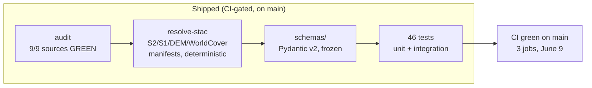
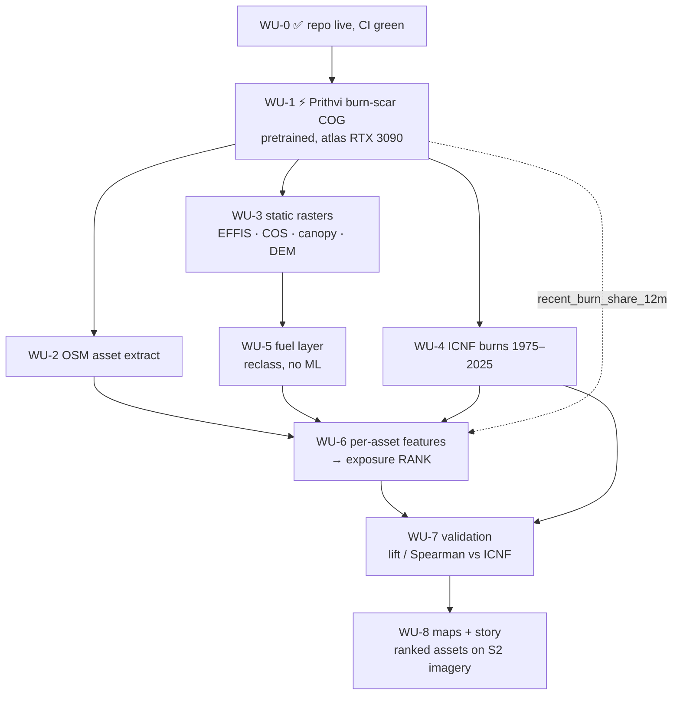

# Roadmap — what exists, what remains

> Companion to [`prompts/00_CLOSEOUT_PLAN.md`](../prompts/00_CLOSEOUT_PLAN.md)
> (the executable direction). This document is the human-readable picture.
> Status date: 2026-06-09, post-WU-0 (CI green on `main`).

## The narrative, in three sentences

Critical infrastructure in Portuguese fire districts — schools, substations,
water-treatment plants, fire stations — is unevenly exposed to wildfire, and
the public hazard maps are land-cover-driven, slow, and asset-agnostic. This
repo ranks every OSM-mapped asset in a pilot district by relative wildfire
exposure using only open data (Sentinel-2, EFFIS fuels, COS land cover,
canopy height, ICNF burn history), with per-asset provenance and validation
against two decades of real burn perimeters. It is a civic-tech
demonstrator: any município, civil-protection office, or researcher can
re-run it on a fresh clone, swap the AOI polygon, and get the same artifacts
for their own district.

## What exists today

Plus the non-code substrate: frozen AOI (`data/aoi/pilot.geojson`, Sever do
Vouga ~30×30 km), infrastructure taxonomy (13 classes), fuel crosswalk
(EFFIS/COS → Scott & Burgan), verified fetch scripts for every source, and
prompts 01–05 + 09 as executable work-unit specs.

## Where it's going (WU sequence)

(Repo edits are strictly sequential — the DAG above shows *data*
dependencies, not session parallelism. See the concurrency rule in the
close-out plan.)

## The final artifact set

| Artifact | Format | Audience |
|---|---|---|
| Ranked asset table | GeoParquet + STAC | analysts, downstream tools |
| Exposure + fuel + burn-scar rasters | COG | GIS users |
| `validation_report.md` | Markdown, reproducible numbers | reviewers |
| Static map figures + one interactive HTML map | PNG / self-contained HTML in `docs/figures/` | everyone — this is the ten-second proof |
| 30-min CPU demo path (`--smoke`) | CLI | anyone with a laptop |

## What this is **not** (unchanged)

No fire-spread simulation, no probability claims (ranks only), no
fine-tuning or training of any model, no private operator data, no
production claims. Future-work notes may mention foundation-model upgrades
(e.g. TerraMind) in one paragraph — they are not on any path here.

<!-- maintained alongside prompts/00_CLOSEOUT_PLAN.md; update both or neither -->
