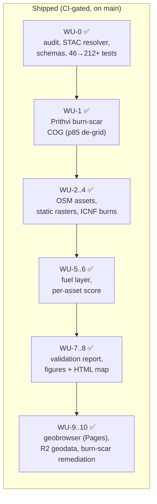

# Roadmap — what exists, what remains

> Companion to [`prompts/00_CLOSEOUT_PLAN.md`](../prompts/00_CLOSEOUT_PLAN.md)
> (the original close-out direction) and
> [`docs/operationalization.md`](operationalization.md)
> (the live six-pillar program — **this is the current executable plan**).
> Status date: 2026-06-16, post-WU-10 burn-scar publish (main is current).
> The "Where it's going" section below records the original WU-0..WU-8
> sequence; the ongoing program is in `docs/operationalization.md`.

## The narrative, in three sentences

Critical infrastructure in Portuguese fire districts — schools, substations,
water-treatment plants, fire stations — is unevenly exposed to wildfire, and
the public hazard maps are land-cover-driven, slow, and asset-agnostic. This
repo ranks every OSM-mapped asset in a pilot district by relative wildfire
exposure using only open data (Sentinel-2, EFFIS fuels, COS land cover,
canopy height, ICNF burn history), with per-asset provenance and validation
against two decades of real burn perimeters. It is a civic-tech
demonstrator: any município, civil-protection office, or researcher can
re-run it on a fresh clone, swap the AOI polygon, and get the same artifacts
for their own district.

## What exists today

As of 2026-06-16 (`main`), the full WU-0..WU-10 pipeline is shipped and
CI-gated:

Frozen AOI (`data/aoi/pilot.geojson`, Sever do Vouga ~30×30 km), 3,045 scored
assets, `config/exposure_score.yaml` v0.2.0, live geobrowser at GitHub Pages
backed by Cloudflare R2 (`wildfire.cheias.pt`). Per-asset provenance,
validation report, and the four gates are all green.

## Where it's going (the six-pillar program)

The original WU-0..WU-8 sequence above is **complete**. The ongoing program is
described in [`docs/operationalization.md`](operationalization.md) — read that
document for the live dependency graph, execution order, and per-pillar
definition-of-done. Summary of what the six pillars address:

| Pillar | Prompt | What it adds |
|---|---|---|
| 0 — Seasonal / FWI | `prompts/17` | Live fire-weather feature; backs the "this season" claim |
| 1 — Network / topology | `prompts/19` | Graph-aware exposure (the headline differentiator) |
| 2 — Widen validation | `prompts/18` | 4 more AOIs → N(burned) into the dozens |
| 3 — Operationalization | `prompts/20` | Planner-facing brief with absolute thresholds |
| 4 — FireScope benchmark | `prompts/21` | Head-to-head vs the public SOTA raster |
| 6 — Housekeeping | `prompts/22` | This doc + `limitations.md` + `scaling.md` + close FLAG A |

The network/topology pillar (Pillar 1) was originally labelled "P2 — later,
higher effort" in `docs/strategy.md` §7. It has been promoted to a Wave-1
parallel WU in the operationalization program because it is the headline
differentiator and a long-lead engineering item. See `docs/strategy.md` §7
item 7 for the reconciliation note.

## The final artifact set

| Artifact | Format | Audience |
|---|---|---|
| Ranked asset table | GeoParquet + STAC | analysts, downstream tools |
| Exposure + fuel + burn-scar rasters | COG | GIS users |
| `validation_report.md` | Markdown, reproducible numbers | reviewers |
| Static map figures + one interactive HTML map | PNG / self-contained HTML in `docs/figures/` | everyone — this is the ten-second proof |
| 30-min CPU demo path (`--smoke`) | CLI | anyone with a laptop |

## What this is **not** (unchanged)

No fire-spread simulation, no probability claims (ranks only), no
fine-tuning or training of any model, no private operator data, no
production claims. Future-work notes may mention foundation-model upgrades
(e.g. TerraMind) in one paragraph — they are not on any path here.

<!-- maintained alongside docs/operationalization.md and docs/strategy.md; update all three when the program changes -->
